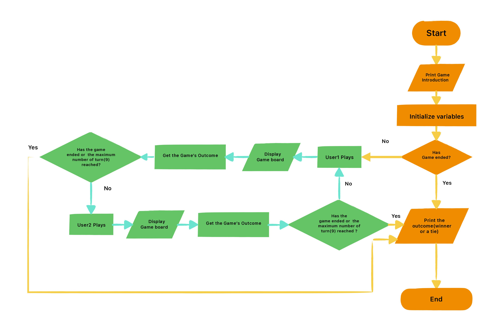
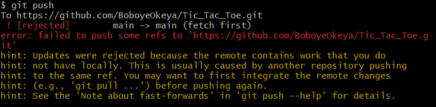
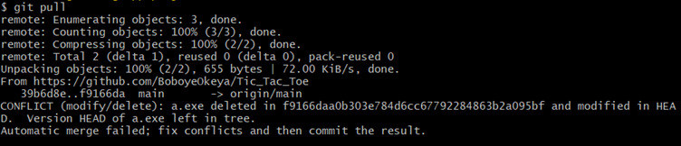
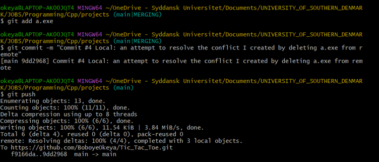
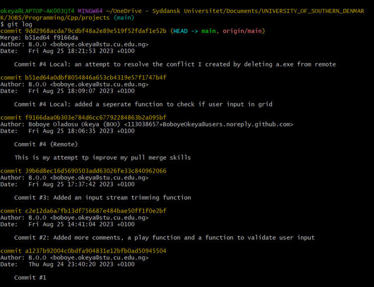
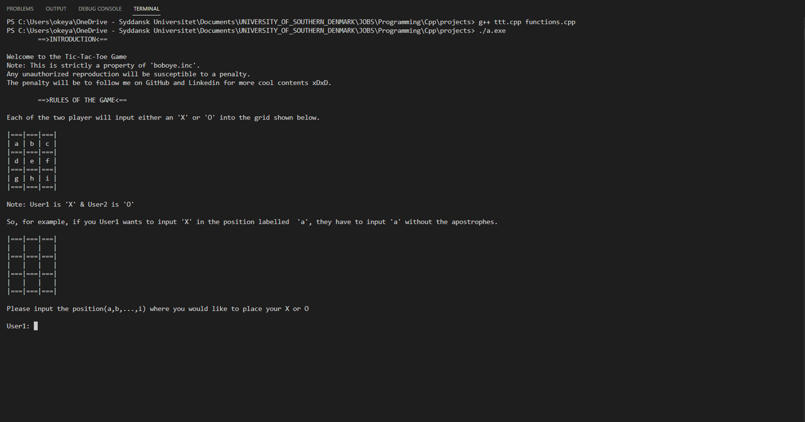
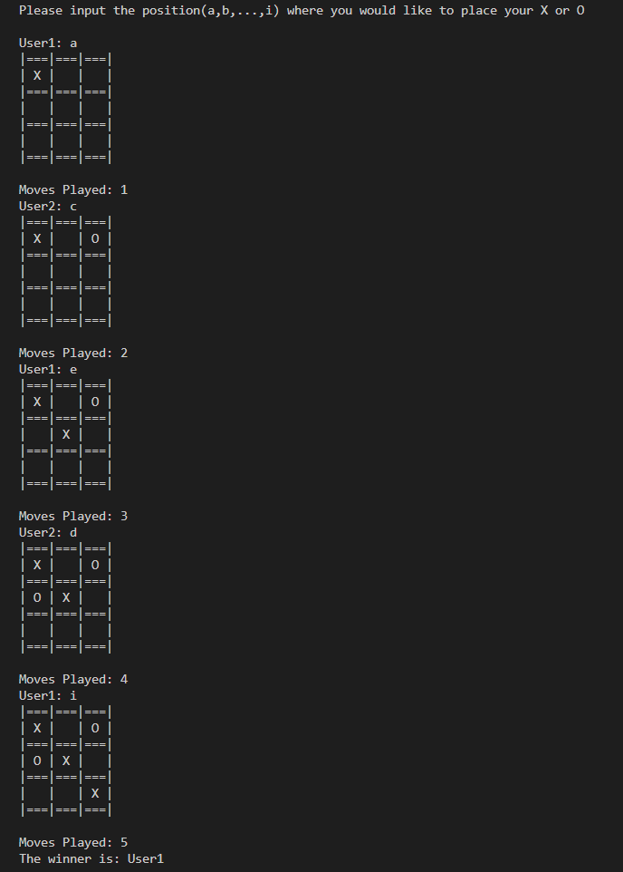

# TIC-TAC-TOE IN C++

## Description of the TIC-TAC-TOE game

This is a 2-player tic-tac-toe game developed in C++.

The first player is `User1` who is denoted by **`X`**, while the second player is `User2` who is denoted by **`O`**.

## The Program's Flowchart

The flowchart for the program is shown below:

 

In this project, I tested out my rusty knowledge of C++ data structures, pointers, and multiple codes files (I also implemented my own header file in `functions.hpp`). 

## Example of a Merge Conflict Resolution

Furthermore, I also deliberately created a `git conflict` just to test out my git conflict resolution skill. The details of the conflict were such that:

*I had created the online remote repository on GitHub and a local reposity on my laptop. I pushed all my commits to the remote. Then to create a conflict, I deleted the execution file (a.exe) file from the remote repo. Then I added some new changes to my local repo and commited to changes locally.*

*So, when I tried to push my newly committed changes to to the remote on GitHub, I got an error message shown below saying that the pushing failed*.

*To solve this, I ran the command `git pull` since I was doing all my changes on the main branch. Note that `git pull` does both fetching and merging. The result of the `git pull` says that there is a conflict since `a.exe` has been deleted in the remote and modified locally. The error message is shown in the figure below*

*To fix this I compiled my C++ program again and generated a new execution file `a.exe`. Then I simply added this new file using `git add a.exe` command. After which I committed the changes. When the commit was done the merging became completed (as shown in the figure below). And then I was able to push my changes successfully to the remote using `git push` command. This is shown in the figure below.*

*In the end all my commits were merged successfully as shown in the figure below*

## How to Run the Program

1. Download and save the program files (ttt.cpp, functions.cpp, & functions.hpp) into a single folder
2. Open a terminal and navigate to the directory of the folder where you saved the files. You can use the `cd` command +  the folder's directory to do this on a windows system
3. Once inside the folder's directory, type the following into the terminal in order to compile the program while linking the two `.cpp` files.

    `g++ ttt.cpp functions.cpp`.
4. Once this is done, the program should be complied and it should produce an execute file `a.exe`. Simply execute this file to play them. Type the following command in order to execute the file in a window's terminal:

    `./a.exe`

Once you have succesfully compliled and execute the program you should get the following output in your terminal

## How to Play the Game and it looks like

Each user is prompted to enter the position where the would like to place their value (either an `X` or `O`). 

The game is also designed to cater for when users input the wrong values such as a string or any character other than those in the range `a-i`.

You can see a sample of the game below:

